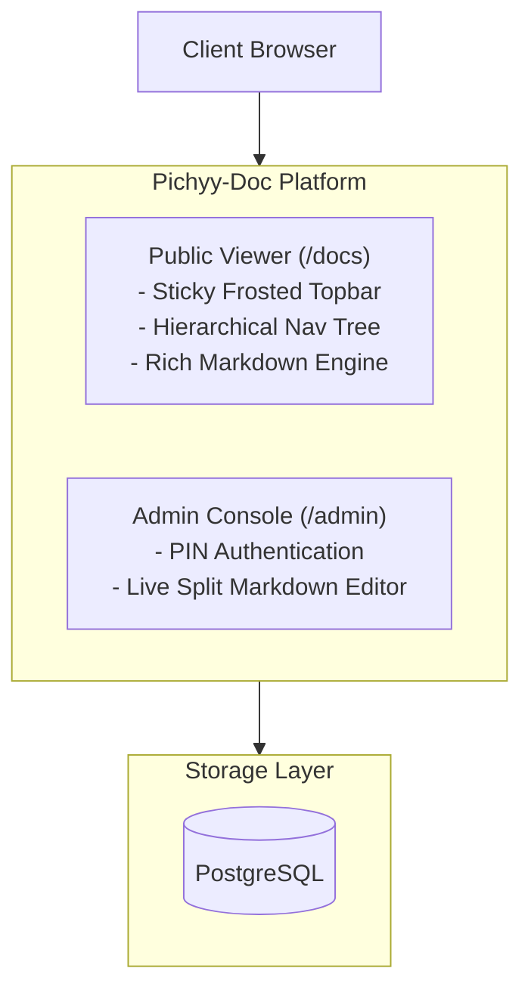
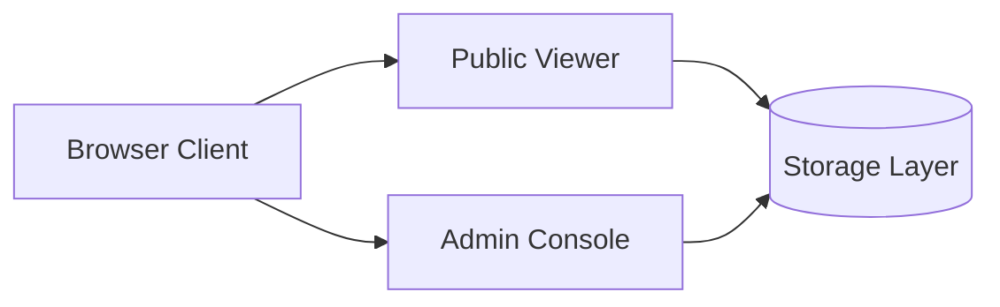

# Pichyy-Doc: AI & Documentation Design Guidelines

> Comprehensive authoritative guide and engineering principles for AI agents, developers, and technical authors contributing to **Pichyy-Doc**.  
> คู่มือและหลักการมาตรฐานสากลสำหรับ AI และผู้พัฒนาในการสร้างเนื้อหาเอกสาร, แผนภาพ Diagram, โค้ด และรูปภาพตามมาตรฐาน **Cloudflare Kumo UI Design System**

---

## Table of Contents
1. [Core Design Philosophy](#1-core-design-philosophy)
2. [Mermaid Diagram Guidelines (หลักการทำ Diagram)](#2-mermaid-diagram-guidelines)
3. [Markdown Authoring Guidelines (หลักการเขียน Markdown)](#3-markdown-authoring-guidelines)
4. [Images & Media Guidelines (หลักการจัดการรูปภาพ)](#4-images--media-guidelines)
5. [Code Blocks & Syntax Highlighting (หลักการจัดการโค้ด)](#5-code-blocks--syntax-highlighting)
6. [Summary Checklist for AI Agents](#6-summary-checklist-for-ai-agents)

---

## 1. Core Design Philosophy

Pichyy-Doc follows the **Cloudflare Kumo UI** philosophy:
- **Utilitarian & High-Density**: Clean 14px body typography (`text-sm`), hairline borders (`border-kumo-line`), zero decorative AI slop.
- **No Nested Frames (Zero Box-in-Box Recursion)**: Avoid stacking containers, cards, subgraphs, and wrappers inside one another.
- **Concise & Low Cognitive Load**: Every node, table, and callout must deliver maximum signal with minimum words.
- **Fast & Responsive**: Mobile-first responsive layouts, instant color transitions without sluggish delays, and ultra-lightweight client bundles.

---

## 2. Mermaid Diagram Guidelines

แผนภาพในระบบ Pichyy-Doc เรนเดอร์เป็น Vector SVG โดยอัตโนมัติ พร้อมรองรับ Light/Dark mode และมีปุ่มสลับ Preview/Code ในตัว

### 2.1 Orientation & Flow Direction
- **DO: Use Horizontal Flow (`flowchart LR` / `graph LR`)**:  
  จัดวางแบบแนวนอน ซ้ายไปขวา ใช้พื้นที่หน้าจอได้คุ้มค่า ไม่ทำให้หน้าเอกสารยาวเป็นหอคอย
- **DON'T: Abuse Vertical Towers (`graph TD`)**:  
  เลี่ยงการต่อโหนดในแนวดิ่งหลายชั้นที่ทำให้ผู้อ่านต้อง scroll หน้าจอยาวโดยไม่จำเป็น

### 2.2 Text Density & Node Labels
- **DO: Keep text concise (2–4 words per node)**:  
  ใส่เฉพาะชื่อ Module หรือ Service เช่น `[Browser Client]`, `[Public Docs]`, `[(Storage Layer)]`
- **DON'T: Put bullet lists or sentences inside diagram nodes**:  
  ❌ ห้ามใส่ bullet points (`- Sticky Topbar\n- Nav Tree`) หรือคำอธิบายยาวๆ ในโหนดเด็ดขาด! คำอธิบายควรอยู่ในเนื้อหา Markdown รอบนอก

### 2.3 Subgraphs & Containers
- **DO: Flat node structures**:  
  เชื่อมต่อโหนดโดยตรง เพื่อให้แผนภาพโปร่งตาและเข้าใจง่าย
- **DON'T: Create nested subgraphs (Box inside box inside card)**:  
  ❌ เลี่ยงการใช้ `subgraph` ซ้อนกันหลายชั้น เพราะตัว Component ของ Pichyy-Doc มีกรอบ hairline อยู่แล้ว หากใน SVG มีกรอบ subgraph ซ้อนกล่อง node อีก จะเกิดปัญหา **"กรอบซ้อนกรอบ"** ที่ดูรกและซ้ำซาก

### 2.4 Good vs Bad Comparison

#### ❌ Bad Example (Bulky, Nested, Wordy)


#### ✅ Good Example (Clean, Compact, Horizontal)


---

## 3. Markdown Authoring Guidelines

### 3.1 Headings & Document Structure
- ใช้ Heading Levels อย่างเป็นลำดับ: `#` (H1 เฉพาะชื่อหน้า), `##` (H2 หัวข้อหลัก), `###` (H3 หัวข้อย่อย)
- ทุก H2 และ H3 จะถูกแปลงเป็น URL Anchor อัตโนมัติสำหรับ Table of Contents (TOC)
- **Sentence Case**: ใช้ตัวพิมพ์เล็กสำหรับหัวข้อภาษาอังกฤษ (ตามเกณฑ์ Kumo UI) เช่น `Quick start & setup` ไม่ใช่ `Quick Start & Setup`

### 3.2 Inline Code vs Code Blocks
- **Inline Code (` `foo` `)**:  
  ใช้สำหรับชื่อฟังก์ชัน, ตัวแปร, คำสั่งสั้นๆ, path หรือ environment variables เช่น `` `DATABASE_URL` ``, `` `npm run dev` ``  
  *หมายเหตุทางเทคนิค*: ระบบมี `PreContext` คอยตรวจจับว่า inline code ต้องไม่แสดงเป็น Card หรือกล่อง code block เต็มขนาด
- **Fenced Code Blocks (```)**:  
  ระบุภาษาของโค้ดเสมอ เช่น ```typescript, ```bash, ```json, ```yaml

### 3.3 Custom Directives (Gallery & Lightbox)
- **Galleries**: ใช้ไวยากรณ์ `:::gallery cols=3 ratio=16:9 border=true`
- **Escaping**: หากต้องการแสดงตัวอย่างการเขียน `:::gallery` ในโค้ด ให้ใส่ไว้ใน Code Fence (````text) ระบบ `splitMarkdownGalleries` จะไม่ตัดแบ่ง code block นั้น

### 3.4 Tables & Callouts
- **Tables**: ใช้ GFM Tables พร้อม hairline borders ไม่ต้องใส่คอลัมน์กว้างเกินจำเป็น
- **Callouts**: ใช้ Blockquote มาตรฐานพร้อมตัวหนานำหน้า:
  ```markdown
  > **Tip**: คำแนะนำที่มีประโยชน์
  > **Warning**: ข้อควรระวังในการตั้งค่า
  ```

---

## 4. Images & Media Guidelines

### 4.1 Storage Location & Git Tracking
| โฟลเดอร์ | การใช้งาน | การติดตามใน Git |
| :--- | :--- | :--- |
| `public/uploads/` | รูปภาพที่ User อัปโหลดผ่าน Admin UI ขณะใช้งานจริง | ❌ Ignored ใน `.gitignore` (มีเฉพาะ `.gitkeep`) |
| `public/demo/` | รูปภาพตัวอย่างสำหรับ Documentation / Starter Content | ✅ Tracked ใน Git (เพื่อให้ clone ไปแล้วเปิดได้ทันที) |

> ⚠️ **ข้อบังคับสำหรับ AI**: เมื่อเพิ่ม Starter Content หรือแก้เอกสารตัวอย่าง ต้องวางรูปภาพไว้ใน `public/demo/` เท่านั้น เพื่อไม่ให้เกิดภาพเสีย (404 Broken Image) เมื่อผู้ใช้นำไป Deploy

### 4.2 Sizing & Optimization
- ขนาดรูปภาพต้องได้รับการ Optimize: ควบคุมให้อยู่ที่ **~100–250 KB ต่อรูป** (ห้ามใส่รูปดิบขนาด 5–10 MB)
- ใช้รูปภาพฟรีที่มีสัญญาอนุญาตชัดเจน (เช่น Unsplash License) และคัดเลือกภาพที่มีสไตล์ Minimalist สะอาดตา

### 4.3 Image Layout Directives (URL Hash Parameters)
Pichyy-Doc รองรับการจัดรูปแบบรูปภาพผ่าน URL Hash Parameters:

```markdown
<!-- รูปภาพเดี่ยว จัดกึ่งกลาง พร้อมกรอบและจำกัดความกว้าง 75% -->


<!-- รูปภาพลอยขนานไปกับเนื้อหาข้อความ (Floating Text Wrap) ทางขวา 45% -->

```

- `border=true|false`: เปิด/ปิดกรอบเส้น hairline รอบรูปภาพ
- `width=100%|75%|50%|300px`: กำหนดความกว้าง
- `align=left|center|right`: จัดตำแหน่งแนวนอน
- `wrap=true|false`: ให้ข้อความไหลล้อมรอบรูปภาพบนเดสก์ท็อป และเรียงต่อกันบนมือถืออัตโนมัติ

---

## 5. Code Blocks & Syntax Highlighting

### 5.1 Architecture & Performance
- **Use `src/lib/highlighter.ts`**:  
  ใช้ `highlight.js/lib/common` (36 ภาษาหลักในการพัฒนาซอฟต์แวร์) + ภาษาเพิ่มเติมที่ลงทะเบียนเฉพาะกิจ (เช่น `dockerfile`)
- **NEVER import root `highlight.js`**:  
  ❌ ห้าม `import hljs from "highlight.js"` แบบ root เพราะจะดึง 190+ ภาษา รวมกว่า 4.6 MB (10,660 modules) ทำให้เกิดบั๊ก Webpack SSR vendor chunk collision (`Cannot find module './vendor-chunks/highlight.js.js'`)
- **`next.config.ts`**:  
  ต้องมี `serverExternalPackages: ["highlight.js"]` เสมอ

### 5.2 Line Numbers & Copy Action
- **Multi-line Blocks**: โค้ดที่มีมากกว่า 1 บรรทัด จะแสดงเลขบรรทัด (Gutter) อัตโนมัติ โดยเลขบรรทัดถูกตั้งค่า `select-none` ทำให้เวลากดลากคลุมหรือกด Copy จะได้เฉพาะเนื้อหาโค้ดสะอาด ไม่ติดเลขบรรทัด
- **Single-line Commands**: คำสั่งบรรทัดเดียว (เช่นคำสั่ง bash install) จะไม่แสดงเลขบรรทัด เพื่อความกะทัดรัด

---

## 6. Summary Checklist for AI Agents

ก่อนส่งมอบงานหรือ commit โค้ดที่เกี่ยวข้องกับระบบเอกสาร AI ต้องตรวจสอบตาม Checklist นี้:

1. [ ] **Diagrams**: เป็น `flowchart LR` สั้นกระชับ ไม่มี bullet points ยาวในโหนด และไม่มี subgraph ซ้อนกรอบ
2. [ ] **Chromes**: ปุ่มควบคุม Preview / Code เป็นแบบ Clean ไม่มีพื้นหลังกล่องและไม่มีกรอบสี่เหลี่ยมหนา
3. [ ] **Icons**: ใช้ Phosphor Icons จาก `@phosphor-icons/react` พร้อม `weight="thin"` ทุกจุด
4. [ ] **Images**: รูปภาพตัวอย่างเก็บใน `public/demo/` น้ำหนักรูป ~100–250 KB
5. [ ] **Highlighter**: เรียกใช้ผ่าน `@/lib/highlighter` และไม่เพิ่ม chunk หนักเกินจำเป็น
6. [ ] **Zero Slop**: ไม่มีอีโมจิตกแต่งใน UI ฟังก์ชันนอล (เช่น 🚀, ✨, 🔒) เน้นความประณีตระดับ Enterprise
7. [ ] **Verification**: รัน `npx tsc --noEmit` ผ่านฉลุย `Exit code 0` ก่อน commit เสมอ
