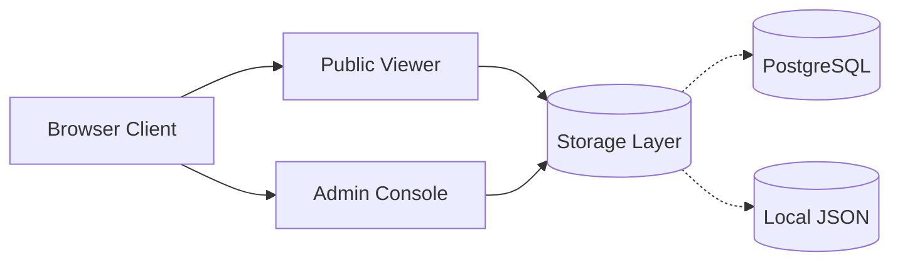

# Pichyy-Doc: Project Hand-off & Operations Guide

> Complete project hand-off specification, architectural blueprint, development runbook, and maintenance checklist for **Pichyy-Doc**.  
> เอกสารส่งมอบงานระบบ (Project Hand-off) คู่มือสถาปัตยกรรม และแนวทางการดูแลรักษาระบบสำหรับผู้พัฒนาและ AI

---

## 📌 Repository & Project Status

- **Project Name**: Pichyy-Doc
- **Official Public Repository**: [https://github.com/PichyyyNews/Pichyy-Doc](https://github.com/PichyyyNews/Pichyy-Doc)
- **License**: MIT License
- **Framework**: Next.js 15.1.7 (React 19, App Router)
- **Design System**: Cloudflare Kumo UI (`@cloudflare/kumo`) + Phosphor Icons (`weight="thin"`)
- **Default Port**: `3000` (`http://localhost:3000`)
- **Admin Portal**: `/admin` (Default PIN: `123456`)
- **Live Documentation Route**: `/docs/guide/handoff`

---

## 🏛️ Architectural Blueprint



---

## ⚙️ Key Subsystems & Implementations

### 1. Dual-Storage Persistence Engine (`src/lib/storage.ts`)
- **Resilient Fallback**: Automatically probes PostgreSQL connectivity (`SELECT 1`). If the database is active, it runs queries through Prisma ORM. If PostgreSQL is omitted or unreachable, it falls back seamlessly to `data/docs-store.json`.
- **Zero-Config Out-of-the-Box**: New clones run immediately with local JSON without needing a local database server.
- **Shared Type Definitions**: `DocSpaceItem`, `CategoryItem`, `DocPageItem`, `TocItem` in `src/lib/types.ts`.

### 2. High-Performance Syntax Highlighter (`src/lib/highlighter.ts`)
- **Lightweight Common Bundle**: Employs `highlight.js/lib/common` (36 high-frequency software engineering languages including TypeScript, JavaScript, Python, Go, Rust, Java, C/C++, C#, PHP, Bash, SQL, JSON, YAML, etc.) plus registered `dockerfile`.
- **SSR Safety**: Configured with `serverExternalPackages: ["highlight.js"]` in `next.config.ts`, eliminating Next.js SSR Webpack vendor chunk collisions (`./vendor-chunks/highlight.js.js`).
- **Clean Line Numbers**: Multi-line code blocks render line numbers with `select-none`, ensuring copied snippets contain pure code.

### 3. Clean Mermaid Diagram Block (`src/components/docs/MermaidBlock.tsx`)
- **Dynamic Vector SVG Rendering**: Transforms ````mermaid ... ```` code fences into theme-adaptive vector SVGs.
- **Clean Minimalist Controls**: Borderless, backgroundless inline `Preview` / `Code` switcher with Phosphor Icons (`weight="thin"`).
- **Adaptive Dark/Light Mode**: Observes document root attributes via `MutationObserver` and instantly re-renders diagrams using Kumo UI dark/light palettes.
- **Graceful Error Catching**: Catches Mermaid syntax errors, displays a non-breaking warning callout, and falls back to highlighted code.

### 4. Media & Gallery Architecture
- **Curated Starter Assets (`public/demo/`)**: Free Unsplash minimalist architecture and modern office photos tracked in Git to guarantee clone-and-run reliability without broken images (404).
- **User Runtime Uploads (`public/uploads/`)**: Ignored in `.gitignore` with `.gitkeep` for user-uploaded production assets.
- **URL Hash Directives**: Supports `#border=true`, `#width=75%`, `#align=center`, and `#wrap=true` (floating text wrap with responsive mobile stacking).
- **Multi-Column Gallery Albums**: `:::gallery cols=3 ratio=16:9 border=true` with interactive fullscreen lightbox.

### 5. Administrative Console (`/admin`)
- **PIN Authentication**: Cookie-based session verification with numeric `ADMIN_PIN` and salted `SESSION_SECRET`.
- **Live Markdown Split-Editor**: Real-time side-by-side authoring preview with drag-and-drop structural organization and TOC anchor manager.

---

## 🚀 Developer Runbook & Shell Scripts

All shell scripts are pre-configured with executable permissions (`chmod +x`) and LF line endings:

| Script | Command | Description |
| :--- | :--- | :--- |
| `setup.sh` | `./setup.sh` | Automated installer: checks Node.js, runs `npm install`, creates `.env`. |
| `dev.sh` | `./dev.sh` | Launches development server on `http://localhost:3000`. |
| `build.sh` | `./build.sh` | Compiles optimized production bundle (`next build`). |
| `start.sh` | `./start.sh` | Starts production server on port 3000 (`next start`). |

### Essential Commands

```bash
# Install dependencies
npm install

# Start local dev server
npm run dev

# Run TypeScript type safety verification
npx tsc --noEmit

# Compile production build
npm run build

# Push database schema (when PostgreSQL is active)
npm run db:push
npm run db:seed
```

---

## 🔐 Environment Variables (`.env`)

| Variable | Default Value | Description |
| :--- | :--- | :--- |
| `DATABASE_URL` | `postgresql://...` | Optional PostgreSQL connection string. When unset, local JSON storage is active. |
| `ADMIN_PIN` | `123456` | 6-digit numeric PIN used to authenticate administrative sessions at `/admin`. |
| `SESSION_SECRET` | `pichyy-doc-secret-...` | Salt string for cryptographic signature of admin session tokens. |
| `NODE_ENV` | `development` | Runtime environment mode (`development` or `production`). |

---

## 🛠️ Known Caveats & Troubleshooting

1. **Windows Dev/Build Concurrency**:
   - Running `npm run dev` and `npm run build` simultaneously on Windows locks the `.next/` cache directory. Stop the dev server before executing `npm run build`.
2. **Highlight.js Root Imports**:
   - Never import root `highlight.js` (4.6 MB / 10,660 modules). Always use `@/lib/highlighter`.
3. **React-Markdown v9 Inline Code**:
   - React-Markdown v9 removed the `inline` boolean prop. The app uses `PreContext` to distinguish inline `<code>` badges from `<pre><code>` code blocks.

---

## 📋 Operational Hand-off & Sign-off Checklist

- [x] Rebranding to Pichyy-Doc completed across all files.
- [x] Public GitHub repository initialized at `https://github.com/PichyyyNews/Pichyy-Doc.git`.
- [x] MIT License and automated shell scripts (`setup.sh`, `dev.sh`, `build.sh`, `start.sh`) added.
- [x] IDE-grade syntax highlighter with multi-language auto-detection and line numbers integrated.
- [x] Real minimalist demo stock images added to `public/demo/`.
- [x] Mermaid diagram engine with adaptive theme and clean tab switcher integrated.
- [x] AI authoring guidelines established in `AI_GUIDELINES.md`.
- [x] Official hand-off document published live at `/docs/guide/handoff` and `HANDOFF.md`.
